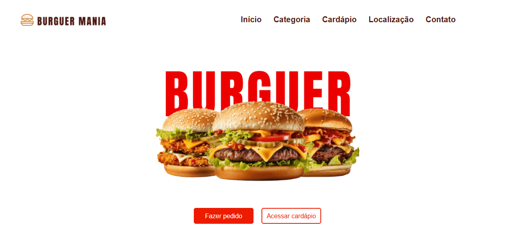

# Hambúrgueria - Frontend Simplificado (Angular)

Este é um projeto frontend simplificado desenvolvido em Angular para uma hambúrgueria. O objetivo é criar uma interface interativa onde os usuários podem navegar pelo cardápio, visualizar detalhes dos produtos, fazer pedidos e mais. O projeto já está integrado com a API criada para gerenciar os dados de produtos e pedidos. Você pode acessar o repositório da API pelo https://github.com/vitorosenbergre/loja-hamburguer-api.

## Funcionalidades

- **Página inicial** com a cara da loja.
- **Categorias** com categorias de hambúrgueres.
- **Menu** com lista de hambúrgueres filtrados por categoria.
- **Detalhes do produto** mostrando informações completas sobre o hambúrguer selecionado.
- **Página de pedidos** onde os usuários podem escolher produtos.
- **Interface responsiva** para diferentes tamanhos de tela.
- **Contato** página para entrar em contato.
- **Localização** mostra a localização real da empresa.

## Tecnologias Usadas

- **Angular** (Framework para o desenvolvimento do frontend)
- **Bootstrap** (Estilização e layout responsivo)
- **API Backend** (A API foi criada com funcionalidades de gerenciamento de produtos e pedidos. O frontend já está integrado com ela para mostrar dados dinâmicos)

## Como Executar o Projeto

1. **Clone o repositório:** Primeiro, clone este repositório para o seu ambiente local:
   ```bash
   git clone https://github.com/vitorosenbergre/Loja-Hamburguer

2. **Navegar até o diretório do projeto:** Certifique-se de estar no reposítorio correto. Em seguida, execute:
    ```bash
    cd seu-repositorio

3. **Instale as dependências:** Certifique-se de ter o Node.js e o npm instalados. Em seguida, execute:
    ```bash
    npm install

4. **Execute a aplicação:** Após a instalação das dependências, execute o comando para iniciar o servidor de desenvolvimento, execute:
    ```bash
    ng serve 

    A aplicação será aberta no seu navegador padrão em http://localhost:4200.

## Futuras Melhorias

- Autenticação de Usuário: Implementar um sistema de login e registro para os usuários realizarem pedidos com conta personalizada.
- Carrinho de Compras: Adicionar um sistema de carrinho para o usuário adicionar e remover itens antes de finalizar o pedido.
- Responsividade Avançada: Melhorar o layout para dispositivos móveis e tablets, incluindo a implementação de um menu de navegação otimizado.
- Animações e Transições: Melhorar a interação do usuário com animações e transições suaves nas trocas de páginas.

## Observações

- O projeto já está integrado com uma API backend para fornecer dados dinâmicos de produtos e pedidos. Você pode acessar o código da API https://github.com/vitorosenbergre/loja-hamburguer-api.
- Este projeto de frontend é um exemplo de integração com a API e pode ser expandido com funcionalidades adicionais, como autenticação e carrinho de compras.

## Visualização

- Print do Home da aplicação.


